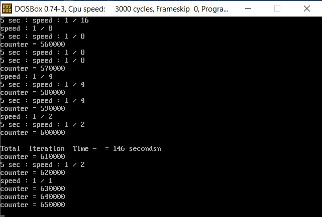

# Interrupts

This Program can be run on 32-bit computer architecture like DOS.
  
Implementation of a new system function: "Program slowdown": int slowPrg();
 

## Program description:
1) Each time the down arrow key is pressed, the execution speed of the system will slow down twice as much as in the previous mode (when the speed is 16 times slower, the down arrow key will no longer have an effect).
2)  Each time the up arrow key is pressed, the execution speed of the system will increase twice as much as in the previous mode (when the speed is the original speed,the up arrow key will no longer have an effect).
3) After each speed change and every 5 seconds, the system speed will be printed on the screen relative to the original speed (for example: speed: 1/16).
4) Pressing the 2 shift (s) right shift and left shift (together for 3 consecutive seconds, disables the entire slowPrg mechanism, restore the system and exits the program.

 

